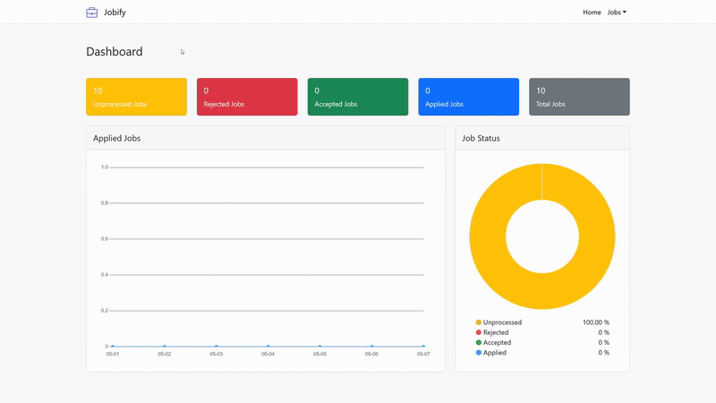
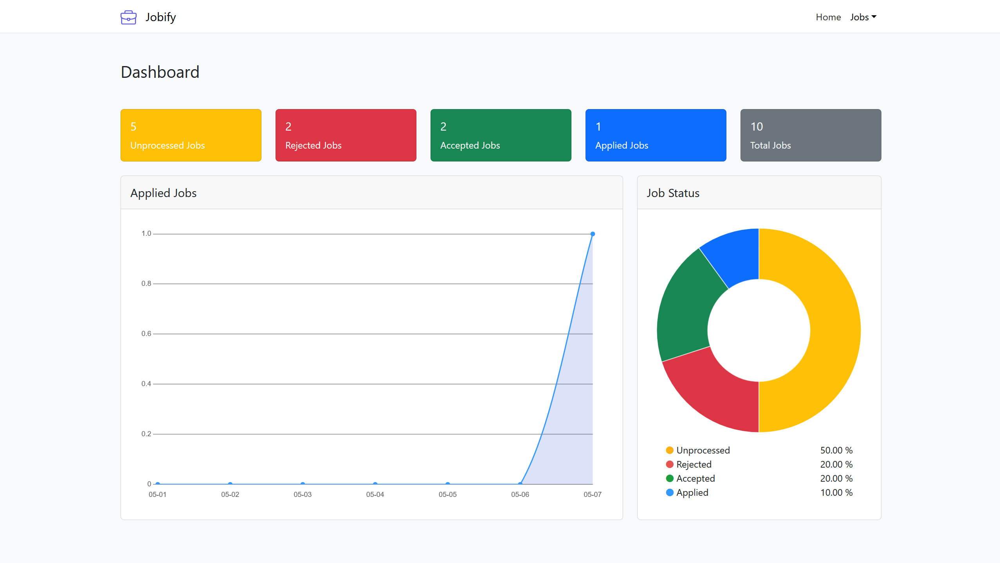
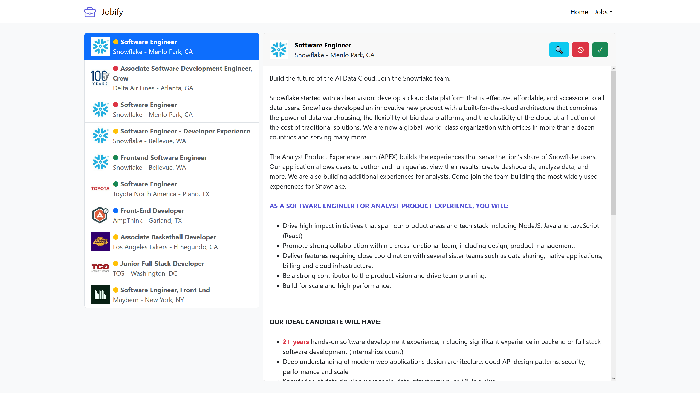

# Jobify

A job search assistant that streamlines job hunting. It scrapes listings from LinkedIn based on your preferences, filters the results, and provides a web interface to organize job postings.






## Table of Contents

* [Overview](#overview)
* [Notice](#notice)
* [Tech Stack](#tech-stack)
* [Scraper](#scraper)
* [Backend](#backend)
* [Client](#client)
* [Installation](#installation)
* [Usage](#usage)
* [Credits](#credits)


## Overview

There are three main parts:

* **Scraper**: Fetch job listings from LinkedIn based on your search filters, processes the content, and stores the posting in a MySQL database.
* **Backend**: A Node.js API that lets you read, update, and manage job data.
* **Client**: A React-based frontend that shows job listings and organize by job status. All job starts off as unprocess. You can either reject or accept them. After creating a list of accpeted job, marking a job as apply will autoamtically open the posting application page.

## Notice

> Scraping LinkedIn violates their Terms of Service. There’s a risk of your IP getting blocked. Using a VPN or proxy is recommended. This program features OpenVPN integration.


## Tech Stack

* Python (Scraper)
* Node.js (Backend)
* React.js (Client)
* MySQL (Database)
* OpenVPN (Optional)


## Scraper

Located in the `scraper` directory. It uses a `config.toml` file for managing settings.

### Config Overview

* **Database**: Set your MySQL host, username, password, and database name.
* **VPN**: You can toggle VPN usage, set how many VPN servers to rotate through, and specify credentials if needed.
* **Requests**: Adjust delays between HTTP requests to avoid getting flagged, and set your user agent string.
* **Search Filters**: Define keywords, locations (with LinkedIn geoIDs), remote/onsite settings, how recent the jobs should be, and how many pages to scrape. The script generates job search combinations by pairing each keyword with every location.
* **Processing**: You can enable or disable content filtering. Right now, it filters out jobs that require more than 3 years of experience (with some leeway for potential false positives) and extracts qualification details to tag in the web app.


## Backend

The backend is a Node.js REST API and is located in the `backend` folder. It uses a `.env` file for managing settings.

Handles all API requests for reading and managing job posts. You can perform CRUD operations via `/jobs`, and view stats from `/statistics`. The database credentials go in a `.env` file.


## Client

The React-based frontend is located in the `client` folder. It displays all job listings and their statuses, letting you filter, accept, reject, or mark as applied. Statuses can be set by buttons or keyboard shortcuts.

### Keyboard Shortcuts

* `W` or `↑` - Previous job
* `S` or `↓` - Next job
* `A` or `←` - Reject job
* `D` or `→` - Accept job
* `F` - Mark as applied


## Installation

Make sure the following are installed:

* Python 3.x
* Node.js (v14 or later recommended)
* MySQL Server
* OpenVPN (optional)

1. **Set Up MySQL**

   * Start the MySQL server.
   * Run the setup script:
    ```sql
    source setup.sql;
    ```

2. **Install Python Dependencies**
   ```bash
   pip install -r requirements.txt
   ```

3. **Set Scraper Configuration**
   * Edit `config.toml` in the `scraper` folder to adjust settings for mysql, vpn, requests, search, and processing.

4. **Configure VPN (Optional)**
   * Place `.ovpn` files in the `vpn` folder, named `1.ovpn`, `2.ovpn`, etc.
   * Add your VPN credentials to `auth.txt`.

5. **Install Backend**

   ```bash
   cd backend
   npm install
   ```

6. **Backend Configuration**
   * Edit `.env` in the `backend` folder to adjust settings for mysql.

7. **Install Frontend**

   ```bash
   cd client
   npm install
   ```


## Usage

Ensure your MySQL server is running.

### 1. Run Scraper

Run with elevated privileges if VPN is enabled:

```bash
sudo python scraper.py
```

### 2. Start Backend

```bash
cd backend
npm start
```

### 3. Start Client

```bash
cd client
npm start
```


## Credits

Icons from [flaticon.com](https://www.flaticon.com)
